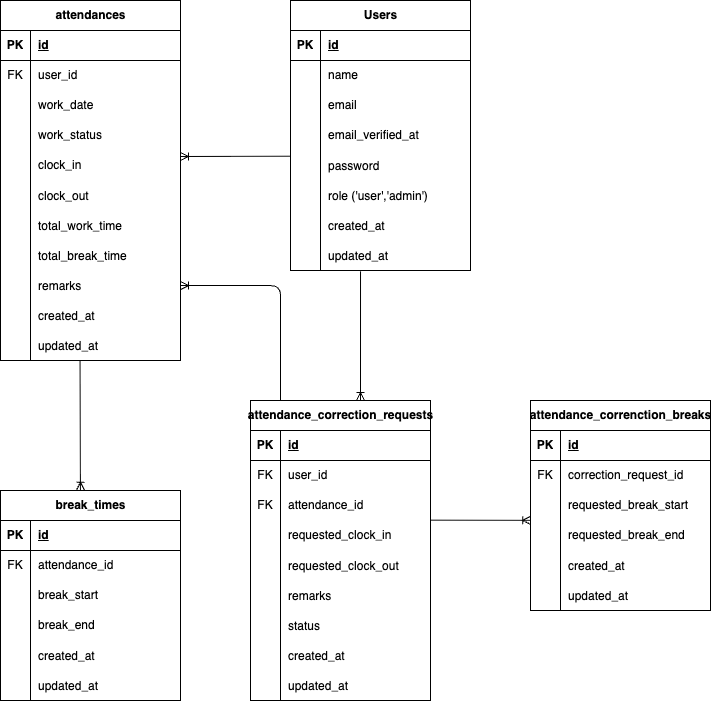

# プロジェクト概要

coachtech 勤怠管理アプリ<br>
出勤・退勤・休憩時間を記録し、勤怠情報を管理できるシステムです。

# 環境構築

1. `git clone https://github.com/pokimaru3/TokajiSuzuka_mogitest2.git`
2. DockerDesktop アプリを立ち上げる
3. `docker-compose up -d --build`

> _Mac の M1・M2 チップの PC の場合、`no matching manifest for linux/arm64/v8 in the manifest list entries`のメッセージが表示されビルドができないことがあります。
> エラーが発生する場合は、docker-compose.yml ファイルの「mysql」内に「platform」の項目を追加で記載してください_

```bash
mysql:
    platform: linux/x86_64(この文追加)
    image: mysql:8.0.26
    environment:
```

**Laravel 環境構築**

1. `docker-compose exec php bash`
2. `composer install`
3. 「.env.example」ファイルを 「.env」ファイルに命名を変更。または、新しく.env ファイルを作成
4. .env に以下の環境変数を追加

```text
DB_CONNECTION=mysql
DB_HOST=mysql
DB_PORT=3306
DB_DATABASE=laravel_db
DB_USERNAME=laravel_user
DB_PASSWORD=laravel_pass
```

5. アプリケーションキーの作成

```bash
php artisan key:generate
```

6. マイグレーションの実行

```bash
php artisan migrate
```

7. シーディングの実行

```bash
php artisan db:seed
```

## 使用技術（実行環境）

- PHP8.1.33
- Laravel8.83.8
- MySQL9.3.0
- Docker / docker-compose

## メール認証

MailHog を使用しています。
MailHog は Docker 上で起動し、実際のメールは送信されず Web UI で確認できます。<br>

### Laravel の設定

.env ファイルに以下を追記または変更してください：<br>

- MAIL_MAILER=smtp
- MAIL_HOST=localhost
- MAIL_PORT=1025
- MAIL_USERNAME=null
- MAIL_PASSWORD=null
- MAIL_ENCRYPTION=null
- MAIL_FROM_ADDRESS="example@example.com"
- MAIL_FROM_NAME="${APP_NAME}"

### MailHog の起動

```bash
docker run -d -p 1025:1025 -p 8025:8025 mailhog/mailhog
```

#### 起動後、次の URL で Web UI が開けます。

http://localhost:8025

## テーブル仕様

### users テーブル

| カラム名          | 型                   | PRIMARY KEY | UNIQUE KEY | NOT NULL | FOREIGN KEY |
| ----------------- | -------------------- | ----------- | ---------- | -------- | ----------- |
| id                | unsigned bigint      | ◯           |            | ◯        |             |
| name              | varchar(20)          |             |            | ◯        |             |
| email             | varchar(255)         |             | ◯          | ◯        |             |
| email_verified_at | timestamp            |             |            |          |             |
| password          | varchar(255)         |             |            | ◯        |             |
| role              | enum('user','admin') |             |            | ◯        |             |
| created_at        | timestamp            |             |            |          |             |
| updated_at        | timestamp            |             |            |          |             |

### attendances テーブル

| カラム名         | 型                                               | PRIMARY KEY | UNIQUE KEY | NOT NULL | FOREIGN KEY |
| ---------------- | ------------------------------------------------ | ----------- | ---------- | -------- | ----------- |
| id               | unsigned bigint                                  | ○           |            | ○        |             |
| user_id          | unsigned bigint                                  |             |            | ○        | users(id)   |
| work_date        | date                                             |             |            | ○        |             |
| work_status      | enum('off_duty','working','on_break','finished') |             |            | ○        |             |
| clock_in         | datetime                                         |             |            |          |             |
| clock_out        | datetime                                         |             |            |          |             |
| total_work_time  | integer                                          |             |            |          |             |
| total_break_time | integer                                          |             |            |          |             |
| remarks          | varchar(255)                                     |             |            | ○        |             |
| created_at       | timestamp                                        |             |            |          |             |
| updated_at       | timestamp                                        |             |            |          |             |

### break_times テーブル

| カラム名      | 型              | PRIMARY KEY | UNIQUE KEY | NOT NULL | FOREIGN KEY     |
| ------------- | --------------- | ----------- | ---------- | -------- | --------------- |
| id            | unsigned bigint | ○           |            | ○        |                 |
| attendance_id | unsigned bigint |             |            | ○        | attendances(id) |
| break_start   | datetime        |             |            | ○        |                 |
| break_end     | datetime        |             |            |          |                 |
| created_at    | timestamp       |             |            |          |                 |
| updated_at    | timestamp       |             |            |          |                 |

### attendance_correction_requests テーブル

| カラム名            | 型                         | PRIMARY KEY | UNIQUE KEY | NOT NULL | FOREIGN KEY     |
| ------------------- | -------------------------- | ----------- | ---------- | -------- | --------------- |
| id                  | unsigned bigint            | ○           |            | ○        |                 |
| attendance_id       | unsigned bigint            |             |            | ○        | attendances(id) |
| user_id             | unsigned bigint            |             |            | ○        | users(id)       |
| requested_clock_in  | datetime                   |             |            |          |                 |
| requested_clock_out | datetime                   |             |            |          |                 |
| remarks             | varchar(255)               |             |            | ○        |                 |
| status              | enum('pending','approved') |             |            | ○        |                 |
| created_at          | timestamp                  |             |            |          |                 |
| updated_at          | timestamp                  |             |            |          |                 |

### attendance_correction_breaks テーブル

| カラム名              | 型              | PRIMARY KEY | UNIQUE KEY | NOT NULL | FOREIGN KEY                        |
| --------------------- | --------------- | ----------- | ---------- | -------- | ---------------------------------- |
| id                    | unsigned bigint | ○           |            | ○        |                                    |
| correction_request_id | unsigned bigint |             |            | ○        | attendance_correction_requests(id) |
| requested_break_start | datetime        |             |            |          |                                    |
| requested_break_end   | datetime        |             |            |          |                                    |
| created_at            | timestamp       |             |            |          |                                    |
| updated_at            | timestamp       |             |            |          |                                    |

## ER 図



## テストアカウント

管理者<br>
メールアドレス:admin@example<br>
パスワード:password12345

---

一般ユーザー<br>

1. 若松 春香
   email: xmurayama@example.com
   password: pass12345<br>
2. 小林 治
   email: atsushi.yamagishi@example.com
   password: pass12345<br>
3. 大垣 京助
   email: tsubasa20@example.com
   password: pass12345<br>
4. 田辺 直子
   email: yamada.yui@example.org
   password: pass12345<br>
5. 原田 知実
   email: matsumoto.chiyo@example.org
   password: pass12345<br>

## PHPUnit のテストについて

```
//テスト用データベースの作成
docker-compose exec mysql bash
mysql -u root -p
//パスワードはrootと入力
create database test_database;
```

#### config ディレクトリの中の database.php を開き、mysql の配列部分をコピーして以下に新たに mysql_test を作成

以下の項目を編集

- 'database' => 'test_database'
- 'username' => 'root'
- 'password' => 'root'

#### テスト用の.env ファイル作成

```
cp .env .env.testing
```

#### .env.testing ファイルの APP_ENV と APP_KEY を編集

- APP_NAME=Laravel
- APP_ENV=test
- APP_KEY=
- APP_DEBUG=true
- APP_URL=http://localhost

#### .env.testing ファイルの DB_DATABASE,DB_USERNAME,DB_PASSWORD を編集

- DB_CONNECTION=mysql_test
- DB_HOST=mysql
- DB_PORT=3306
- DB_DATABASE=test_database
- DB_USERNAME=root
- DB_PASSWORD=root

#### アプリケーションキーを作成

```
php artisan key:generate --env=testing
```

#### マイグレーション

```
php artisan migrate --env=testing
```

#### PHPUnit の設定

テストを専用データベースで実行するため、`phpunit.xml` を編集してください。

```diff
- <!-- <server name="DB_CONNECTION" value="sqlite"/> -->
- <!-- <server name="DB_DATABASE" value=":memory:"/> -->
+ <server name="DB_CONNECTION" value="mysql_test"/>
+ <server name="DB_DATABASE" value="test_database"/>
```

#### テストの実行

```
php artisan test
```
